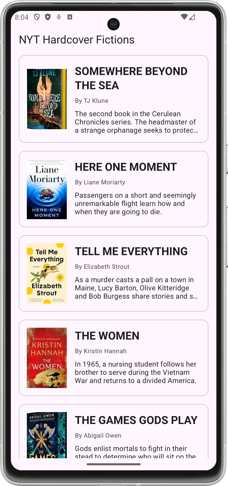
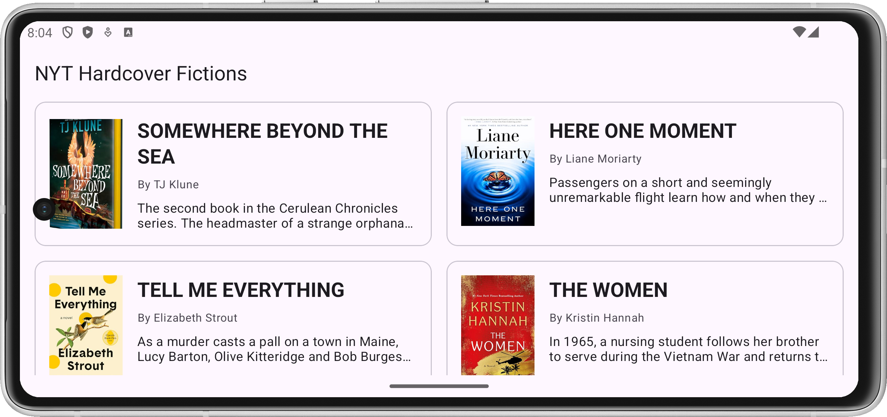
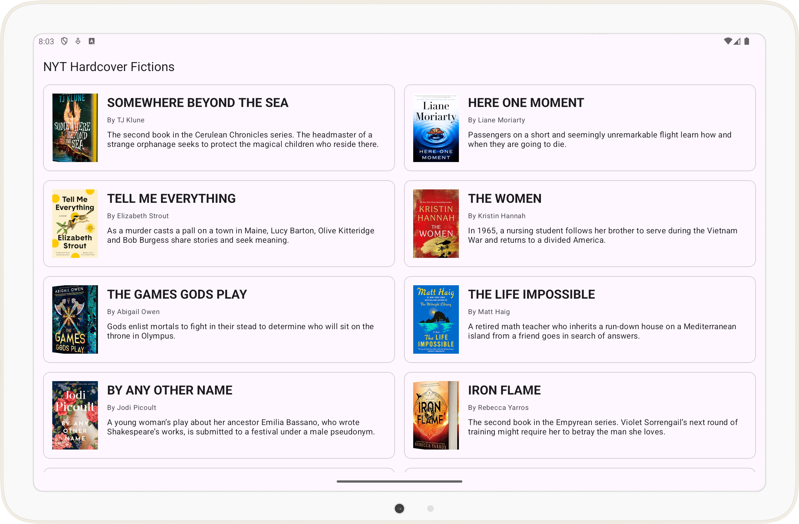

# The Challenge:

This is a simple Android app that exercises a REST-ful API and shows a list of different books published by the New York Times. The API endpoint `https://api.nytimes.com/svc/books/v3/lists/current/hardcover-fiction.json?api-key=KoRB4K5LRHygfjCL2AH6iQ7NeUqDAGAB&offset=0`. 

## System Requirement:

- App tested with `Android Studio Koala Feature Drop | 2024.1.2 Patch 1`

## Important Dependencies

- Kotlin 2.0.20
- Various AndroidX libraries for core functionality
- Dagger for dependency injection
- Glide for image loading
- Retrofit for networking
- KotlinX Serialization for serializing data
- Paparazzi for snapshot testing
- Timber for logging

## App Screenshots

### Phone - Pixel 8a

| Portrait                     | Landscape                         |
|------------------------------|-----------------------------------|
|  |  |

### Tablet - Pixel Tablet



## Screenshot Testing

This app uses [Paparazzi](https://cashapp.github.io/paparazzi/) to perform snapshot testing.

Look at `BookListItemSnapshotTest.kt` for reference. It captures various snapshots that cover phone
UI, tablet UI, day and night mode, font scaling for accessibility etc.

To verify the screenshots, run from root folder
```shell
./gradlew verifyPaparazziDebug
```

To record new screenshots, run from root folder
```shell
./gradlew recordPaparazziDebug
```

## Command to format, test and build debug app

A custom Gradle task has been created to easy of use that would execute all important tasks for the build

```shell
./gradlew formatTestAssemble
```