## The Solution Writeup

**Hey! Farhad here.**  I'll be explaining how I developed the app to meet the challenge
requirements.

### Features of the app

- displaying list of hardcover fictions from the NY Times api.
- displaying the book cover image, with placeholder fallback.
- saving the books in a local database to support offline mode.
- caching images of the book covers to support offline mode.
- displaying shimmering rows while books are being fetched.
- displaying an error message when the app fails to retrieve any data from api and database and a
  button to retry.
- displaying a message when the books list is empty and a button to retry.
- supporting display in portrait and landscape mode.

### Talk is cheap. Show me how it works.

- Here's a screen recording of the app going through different states after a fresh
  install: 

### Screens Gallery

- online list states (notice the book cover placeholder when image loading fails).  
  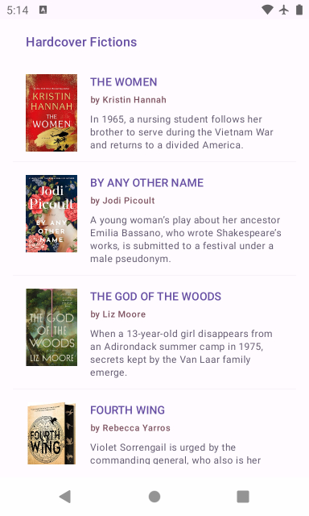
  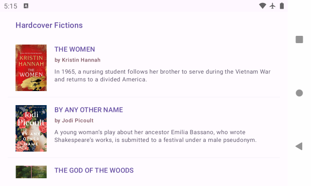
  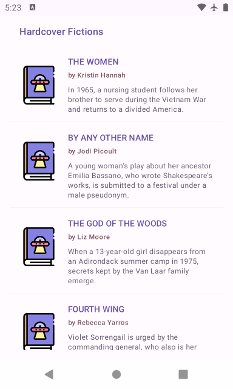

- offline list states (notice the book cover placeholder when image loading fails).  
  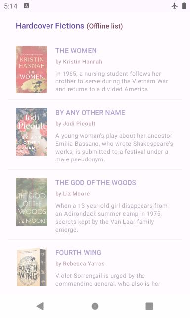
  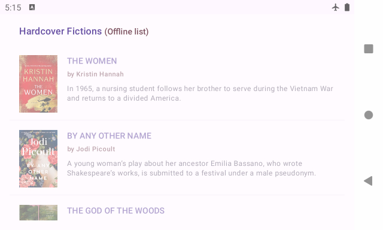
  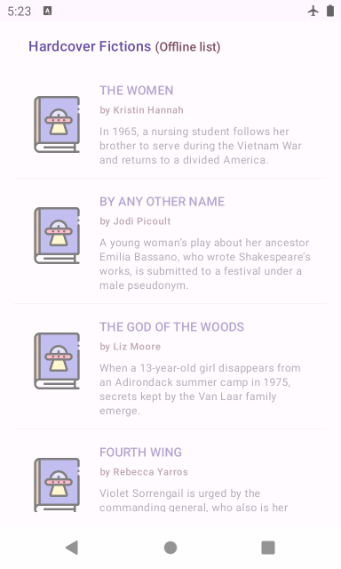

- loading states.  
  
  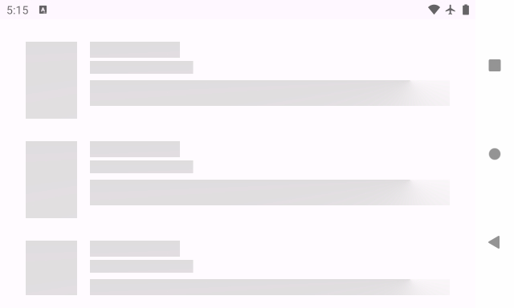

- empty state  
  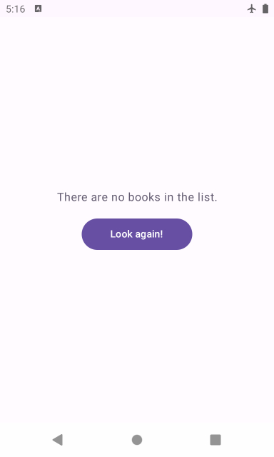

- error state.  
  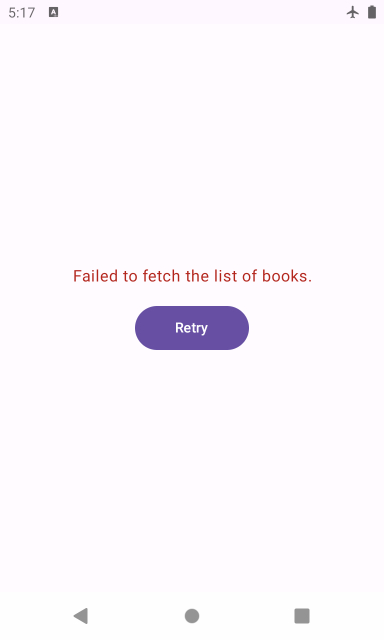

### Architecture

- As mentioned in the challenge statement, I've adopted MVP architecture in my development. Here's
  how
  different layers and tools fit into the MVP architecture.
  - `Model`
    - fundamental `Book` model class and the different states that a list fetch operation would end
      in.
  - `View`
    - activity, viewModel, and jetpack compose components. The meat and potatoes of the frontend.
  - `Presenter`
    - This is the layer that sits between the view and data sources, and is where I've embedded the `business logic` of the app, so to speak.  
      This class tabulates data from various repositories and prepares them for downstream consumption. 
      ViewModel receives the calls and routes user interactions to the presenter and remains
      agnostic of where the data comes from or how it is structured.  
      Presenter also lives independent of data storage technology and contains mostly high level
      domain logic.  
    - Local and remote repositories, a.k.a database and web api interface, are abstracted away from
      the presenter through the Repository interface. 
      They're not an official layer per se, but they are the gateway to the execution & storage
      environment which is the Android OS. So they're kept as far away from the domain code as
      possible.

### Architectural Practices and Design Patterns

- Avoided creating smart or God objects, adhering to single-responsibility classes.
- Unidirectional data flow and single source of truth, through `data` package and `Repository`
  interface.
- Using interfaces to enforce Liskov Substitution Principle (LSP), creating easily-testable and
  replaceable implementations.
  This would allow different layers to grow mostly in isolation of each other. For instance, the
  adoption of a new networking library should not leak into irrelevant layers of the architecture.
- Dagger2 for dependency injection and enforcing separation of concerns across layers.

### Tools and libraries

- Activity, ViewModel, Jetpack compose, and material components for building the ui.
- Coroutines for concurrency.
- StateFlow for reactive streams.
- Room for local data storage.
- Retrofit and Glide for fetching network resources.
- Moshi for serialization.
- Junit and Mockito for unit testing.

### UI and Unit Testing

- There are `11` unit tests for the `BookListPresenterImpl` and `BookListViewModel`. To ensure that the app always ends up in the correct state.
- I've also added the following jetpack compose `previews` in `BooksListContent` class.  
  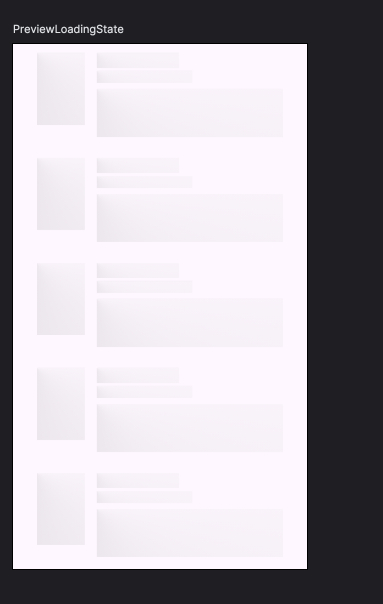
  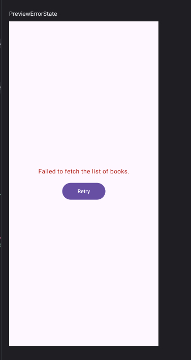
  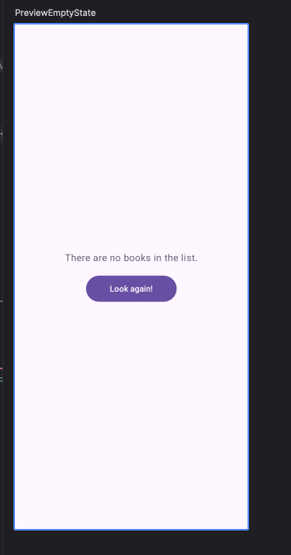
  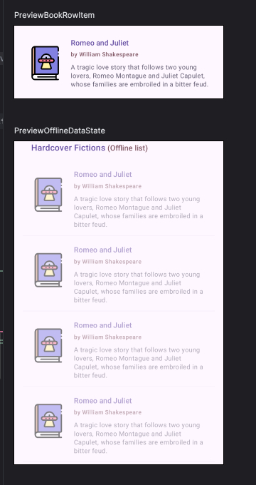
  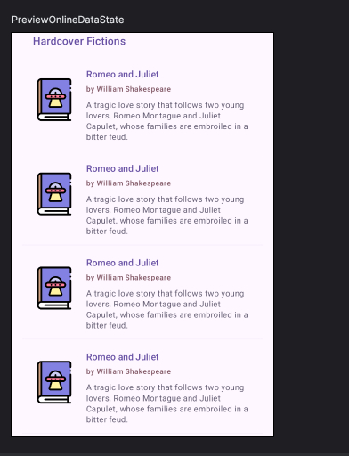

### Further improvements

- The api key is currently hardcoded. This could of course be stored securely and fed to the remote
  repository.
- The api returns weekly data. It makes sense to remove the stale data when the timestamp is updated
  from the response.
- List heading, copyright message, and data timestamp can also be fed to the ui. This would require
  saving more data in the database.
- The api accepts an offset which would suggest that it supports pagination. This can be added later
  as a feature to the list.
- When in offline list mode, it would make sense for a refresh button to be on the screen so the user can try to get fresh
  data without having to nuke the app.
- The api returns an array of `buy links` for each item. It could be a useful ui feature to have a 'purchase'
  buttons for different online stores.

# The Challenge:

The challenge is to create a simple Android app that exercises a REST-ful API. The API endpoint `https://api.nytimes.com/svc/books/v3/lists/current/hardcover-fiction.json?api-key=KoRB4K5LRHygfjCL2AH6iQ7NeUqDAGAB&offset=0` returns a JSON object which is a list of different books published by the New York Times. 

Using this endpoint, show a list of these items, with each row displaying at least the following data:

- Image
- Title
- Description 

### Technical Instructions:
- MVP architecture, no ViewModel
- XML Layouts (no Compose)
- Demonstrate use of Dagger, Retrofit and Glide (for the images)
- No database needed
- Feel free to make any assumptions you want along the way or use any third party libraries as needed and document why you used them.

### General Instructions:
- This isn't a visual design exercise. For example, if you set random background colors to clearly differentiate the views when debugging, pick Comic Sans or Papyrus, we won't hold that against you. Well, maybe a little bit if you use Comic Sans :)
- This is also most of the code you'll be showing us – don't underestimate the difficulty of the
  task, or the importance of this exercise in our process, and rush your PR. Put up your best
  professional game.
- This isn't just about handling the happy path. Think slow network (or no network at all),
  supporting different device sizes, ease of build and run of the project. If we can't check out and
  click the run button in Android Studio, you're off to a bad start (we've had PRs without a gradle
  for instance).
- Explanations on any choice you've made are welcome.
- We appreciate there's a lot that is asked in this exercise. If you need more time, feel free to ask. If you need to de-prioritize something, apply the same judgement you would on a professional project, argument your decision. 

Bonus Points:
  - Unit tests
