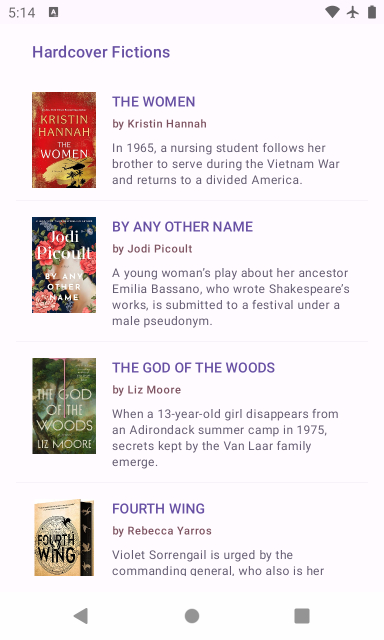
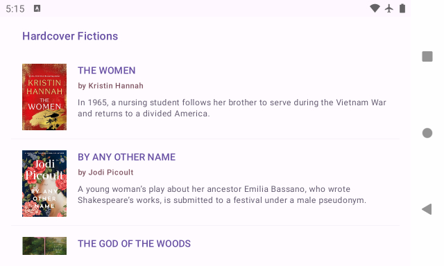
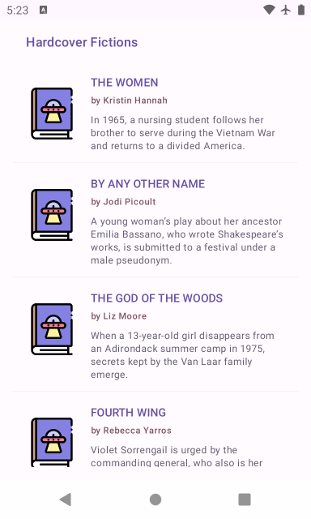
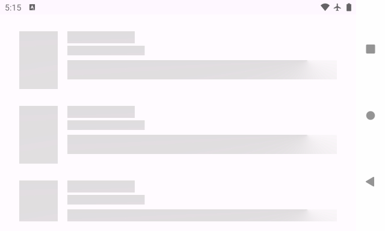
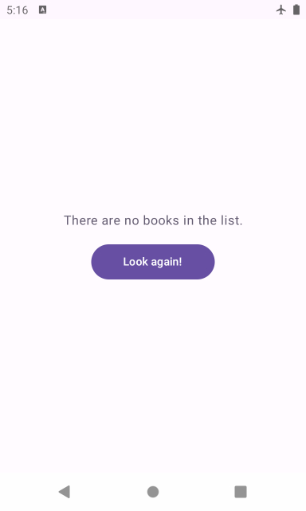
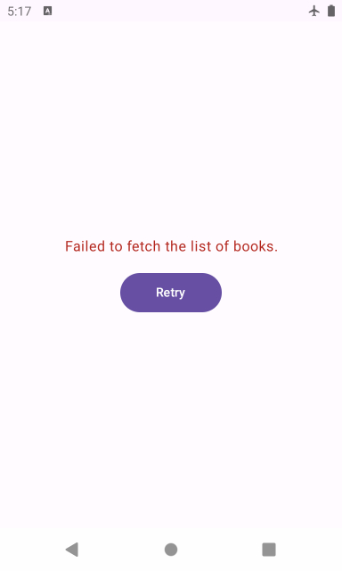
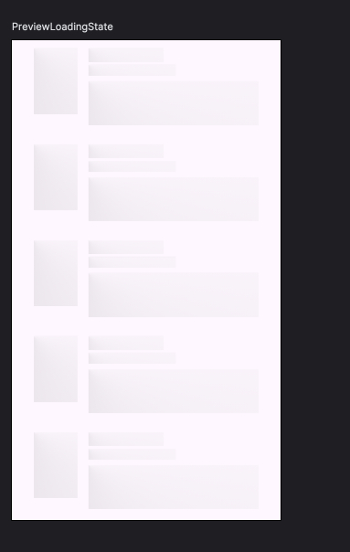
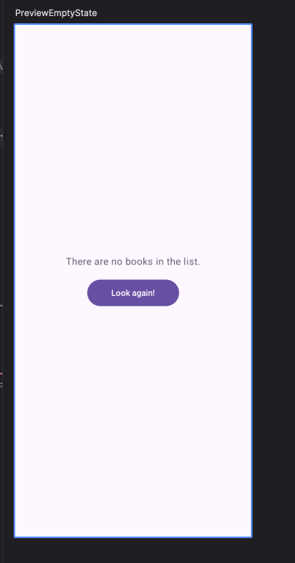
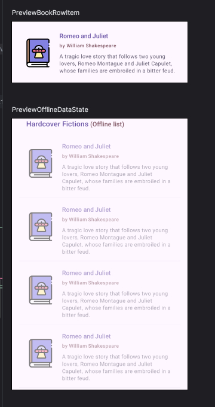
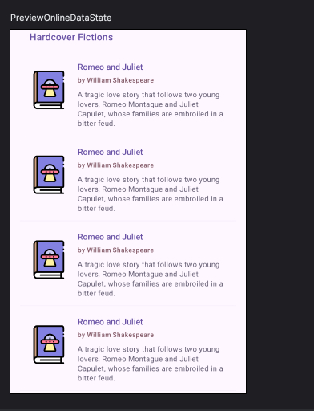

## The Solution Writeup

**Hey! Farhad here.**  This is an updated implementation of the challenge, using MVP
architecture, dagger2, and
without viewModels.

### Features of the app

- displaying list of hardcover fictions from the NY Times api.
- displaying the book cover image, with placeholder fallback.
- caching images of the book covers to support offline mode.
- displaying shimmering rows while books are being fetched.
- displaying an error message when the app fails to retrieve any data from api and a button to
  retry.
- displaying a message when the books list is empty and a button to retry.
- supporting display in portrait and landscape mode.

### Screen Recording

- Here's a screen recording of the app going through different states after a fresh
  install: 

### Screens Gallery

- online list states (notice the book cover placeholder when image loading fails).  
  
  
  

- loading states.  
  
  

- empty state  
  

- error state.  
  

### Architecture

- the code is arranged based on MVP clean architecture practices.
  Here are how different layers and classes fit into the architecture.
  - `Model`
    - The `data` package embeds where the data comes from.
    - Abstractions of web api interface and local database, as well their implementations can be
      found in this package.

  - `Usecase`
    - The `usecase` layer is the place to encapsulate high level business logic of the app. In my
      implementation
      it gathers data from various repositories and prepares the result.
    - Local and remote repositories, are abstracted away from
      the usecase through the Repository interface. 
      They're the gateway to the execution & storage environment, so they're kept as far away from
      the domain code as
      possible.

  - `View & Presenter`
    - The `ui` package groups the view code by features. Each feature subpackage consists of view
      and presenter classes.
    - BooksList ui is implemented using an activity and jetpack compose components.
    - Presenter builds the ui state by utilizing an injected usecase class, that has all the
      business logic and data tabulation embedded in it.
    - Presenter translates, or maps, the results of usecase actions into the `UiState`.
    - `UiState` and `UseCaseResult` share terminology but have different consumers and can have
      independent lifecycles.

### Architectural Practices and Design Patterns

- Adopted clean architecture principles in MVP implementation.
- Avoided creating smart or God objects, adhering to single-responsibility classes.
- Unidirectional data flow and single source of truth, through `model` package and `Repository`
  interface.
- Utilized UseCases to embed domain and business logic implementation, as opposed to hard-coupling
  it with presenter code.
- Using interfaces to enforce Liskov Substitution Principle (LSP), creating easily-testable and
  replaceable implementations.
  This would allow different layers to grow mostly in isolation of each other. For instance, the
  adoption of a new networking library should not leak into irrelevant layers of the architecture.
- Dagger2 for dependency injection and enforcing separation of concerns across layers.

### Handling configuration changes

- The app is developed in such a way to preserve its state during and after a configuration change.
- It accomplishes this by using a singleton instance of the Presenter (enforced at DI level),
  and making sure the view (activity) only attaches itself to the presenter at first time of
  creation.
- There is no special treatment to prevent activity recreation in place, so subsequent device
  rotations will not retain the activity instance.
- However, as the Presenter is singleton and
  view checks whether it needs to 're-attach' itself, ui state is remembered and app does not crash.
- When the user presses back button, the presenter is detached from the view and all the ongoing api
  calls are aborted.
  We can't use the onDestroy() call because the activity instance is not retained.
- The app does not cache any retrofit responses. Although the local database pipeline is wired in,
  currently no data is saved in it.

### Tools and libraries

- Activity, Jetpack compose, and material components for building the ui
  - using RecyclerView, ConstraintLayout and DataBinding would have been possible too,
    had it been documented in a timely manner.
- Coroutines for concurrency.
- LiveData for sending data updates from presenter to view asynchronously and reactively.
- Retrofit and Glide for fetching network resources.
- Moshi for serialization.
- Junit and Mockito for unit testing.

### Unit Testing

- `BooksListPresenterTest` and `BooksListUseCaseTest` verify the app's state changes according to
  data sources, from data layer all the way through presenter.

### UI Testing

- No App crashes or ANRs happening on the app.
- I've also added the following jetpack compose `previews` in `BooksListContent` class.  
  
  
  
  
  

### Further improvements

- The api key is currently hardcoded. This could of course be stored securely and fed to the remote
  repository.
- The api returns weekly data. It makes sense to remove the stale data when the timestamp is updated
  from the response.
- List heading, copyright message, and data timestamp can also be fed to the ui. This would require
  saving more data in the database.
- The api accepts an offset which would suggest that it supports pagination. This can be added later
  as a feature to the list.
- When in offline list mode, it would make sense for a refresh button to be on the screen so the
  user can try to get fresh
  data without having to nuke the app.
- The api returns an array of `buy links` for each item. It could be a useful ui feature to have a '
  purchase'
  buttons for different online stores.

# The Challenge:

The challenge is to create a simple Android app that exercises a REST-ful API. The API endpoint `https://api.nytimes.com/svc/books/v3/lists/current/hardcover-fiction.json?api-key=KoRB4K5LRHygfjCL2AH6iQ7NeUqDAGAB&offset=0` returns a JSON object which is a list of different books published by the New York Times. 

Using this endpoint, show a list of these items, with each row displaying at least the following data:

- Image
- Title
- Description 

### Technical Instructions:
- MVP architecture, no ViewModel
- XML Layouts (no Compose)
- Demonstrate use of Dagger, Retrofit and Glide (for the images)
- No database needed
- Feel free to make any assumptions you want along the way or use any third party libraries as needed and document why you used them.

### General Instructions:
- This isn't a visual design exercise. For example, if you set random background colors to clearly differentiate the views when debugging, pick Comic Sans or Papyrus, we won't hold that against you. Well, maybe a little bit if you use Comic Sans :)
- This is also most of the code you'll be showing us – don't underestimate the difficulty of the
  task, or the importance of this exercise in our process, and rush your PR. Put up your best
  professional game.
- This isn't just about handling the happy path. Think slow network (or no network at all),
  supporting different device sizes, ease of build and run of the project. If we can't check out and
  click the run button in Android Studio, you're off to a bad start (we've had PRs without a gradle
  for instance).
- Explanations on any choice you've made are welcome.
- We appreciate there's a lot that is asked in this exercise. If you need more time, feel free to ask. If you need to de-prioritize something, apply the same judgement you would on a professional project, argument your decision. 

Bonus Points:
  - Unit tests
